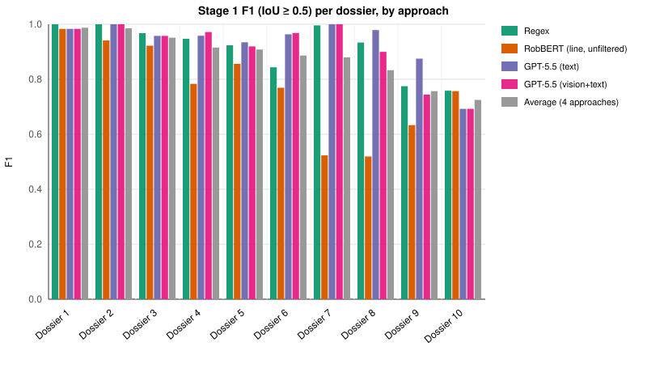
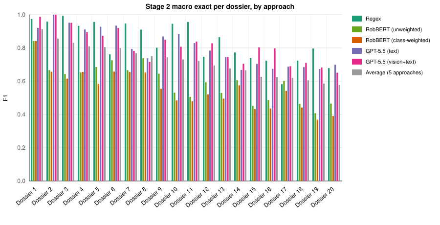

# Results Summary

All scores computed on held-out test sets using `scripts/evaluate.py` (exact F1)
and `scripts/compute_anls.py` (ANLS*). ANLS* uses the `anls-star` package
(Peer et al., 2024), restricted to emails where the field is present to avoid
inflating scores from correct non-predictions on absent fields.

The corpus comprises 20 Woo PDF dossiers (2,013 emails total). Stage 1 is
evaluated on a dossier-level holdout (10 train / 10 test dossiers). Stage 2 is
evaluated on an email-level holdout within the same 20 dossiers (1,006 train /
1,007 test emails).

---

## Stage 1 — Email Boundary Detection

Evaluated on 10 held-out test dossiers (1,007 ground-truth email boundaries).
A prediction is a true positive if its IoU with the ground-truth span ≥ 0.5.
All four approaches are evaluated on the identical set of dossiers and
ground-truth predictions saved in `data/results/stage1_raw_predictions.json`.

### Summary (IoU ≥ 0.5)

| Approach | Precision | Recall | F1 | Predicted e-mails |
|---|---|---|---|---|
| Regex | 0.912 | 0.921 | 0.915 | 994 |
| RobBERT (line, unfiltered) | 0.701 | 0.916 | 0.769 | 1776 |
| GPT-5.5 (text) | **0.949** | **0.923** | **0.934** | 1003 |
| GPT-5.5 (vision+text) | 0.947 | 0.886 | 0.914 | 951 |

(1,007 ground-truth emails across the 10 test dossiers.)

### IoU threshold sweep (macro-averaged F1)

Computed from the same saved predictions via `scripts/compute_iou_sweep.py`,
showing how strictly each approach's spans align with the ground truth.

| Approach | F1@0.3 | F1@0.5 | F1@0.7 | F1@0.9 | F1@1.0 |
|---|---|---|---|---|---|
| Regex | 0.926 | 0.915 | 0.878 | **0.811** | **0.759** |
| RobBERT (line, unfiltered) | 0.779 | 0.769 | 0.712 | 0.618 | 0.400 |
| GPT-5.5 (text) | **0.955** | **0.934** | **0.892** | 0.772 | 0.601 |
| GPT-5.5 (vision+text) | 0.941 | 0.914 | 0.865 | 0.749 | 0.594 |

### Post-hoc: proximity filter for RobBERT (line)

The "RobBERT (line, unfiltered)" row above predicts a new email start for
every line independently classified as a header start, with no
post-processing.

As a post-hoc experiment (`scripts/compare_proximity_filter.py`), a simple
proximity filter collapses any predicted start within 8 lines of the
previous kept start into that previous span (re-using the saved raw spans —
no re-inference needed):

| Variant | Precision | Recall | F1 | Predicted e-mails |
|---|---|---|---|---|
| RobBERT (line, unfiltered) | 0.701 | 0.916 | 0.769 | 1776 |
| RobBERT (line + proximity filter, post-hoc) | **0.957** | 0.886 | **0.919** | 914 |

This filter is **not** used as the headline RobBERT result — it's a
post-hoc, hand-tuned heuristic (window size 8 was not learned/validated)
applied after inspecting the test-set errors, so it isn't directly
comparable to the other approaches under the same evaluation protocol.
Per-dossier results: `data/results/stage1_proximity_filter_comparison.csv`.

### Per-dossier difficulty (cross-approach)

F1 (IoU ≥ 0.5) for each approach, broken down by dossier (anonymized as
"Dossier 1"-"Dossier 10") and sorted by the average F1 across all four
approaches (`data/results/stage1_dossier_variance_bars.csv`):

| Dossier | Regex | RobBERT (line, unfiltered) | GPT-5.5 (text) | GPT-5.5 (vision+text) | Average | Range (max-min) | Std dev |
|---|---|---|---|---|---|---|---|
| Dossier 1 | 1.000 | 0.983 | 0.983 | 0.983 | **0.987** | 0.017 | 0.007 |
| Dossier 2 | 1.000 | 0.941 | 1.000 | 1.000 | **0.985** | 0.059 | 0.026 |
| Dossier 3 | 0.968 | 0.922 | 0.958 | 0.958 | **0.951** | 0.046 | 0.018 |
| Dossier 4 | 0.947 | 0.783 | 0.958 | 0.972 | **0.915** | 0.189 | 0.077 |
| Dossier 5 | 0.924 | 0.856 | 0.934 | 0.919 | **0.908** | 0.078 | 0.031 |
| Dossier 6 | 0.844 | 0.769 | 0.964 | 0.968 | **0.886** | 0.199 | 0.084 |
| Dossier 7 | 0.996 | 0.523 | 1.000 | 1.000 | **0.880** | 0.477 | 0.206 |
| Dossier 8 | 0.934 | 0.519 | 0.979 | 0.900 | **0.833** | 0.460 | 0.183 |
| Dossier 9 | 0.775 | 0.633 | 0.875 | 0.744 | **0.757** | 0.242 | 0.086 |
| Dossier 10 | 0.759 | 0.757 | 0.692 | 0.692 | **0.725** | 0.067 | 0.033 |

Range and std dev are computed across the four approaches' F1 scores for
each dossier.

### Cross-approach correlation of per-dossier scores

Pearson correlation between approaches' F1 scores across the 10 test
dossiers (`data/results/stage1_dossier_variance_bars.csv`).

| | Regex | RobBERT (line, unfiltered) | GPT-5.5 (text) | GPT-5.5 (vision+text) |
|---|---|---|---|---|
| Regex | 1.00 | 0.28 | 0.82 | 0.89 |
| RobBERT (line, unfiltered) | 0.28 | 1.00 | 0.07 | 0.28 |
| GPT-5.5 (text) | 0.82 | 0.07 | 1.00 | 0.90 |
| GPT-5.5 (vision+text) | 0.89 | 0.28 | 0.90 | 1.00 |

Average pairwise correlation: 0.540.

---

## Stage 2 — Email Field Extraction

Evaluated on 1,007 held-out test emails spanning all 20 dossiers.

### Macro-level summary

| Approach | Exact macro F1 | ANLS* (present-field) |
|---|---|---|
| Regex | **0.830** | 0.823 |
| RobBERT (token, unweighted) | 0.525 | 0.794 |
| RobBERT (token, class-weighted) | 0.486 | **0.847** |
| GPT-5.5 (text) | 0.744 | 0.815 |
| GPT-5.5 (vision+text) | 0.752 | 0.844 |

### Per-field breakdown — exact F1

| Field | Regex | RobBERT (unweighted) | RobBERT (class-weighted) | GPT-5.5 (text) | GPT-5.5 (vision+text) |
|---|---|---|---|---|---|
| FROM | 0.949 | 0.601 | 0.589 | **0.966** | 0.964 |
| TO | 0.854 | 0.538 | 0.473 | **0.895** | 0.876 |
| CC | **0.814** | 0.610 | 0.568 | 0.310 | 0.354 |
| DATE | 0.977 | 0.905 | 0.837 | **0.982** | 0.978 |
| SUBJECT | 0.922 | 0.463 | 0.430 | **0.950** | 0.949 |
| ATTACHMENT | **0.465** | 0.033 | 0.017 | 0.365 | 0.395 |

### Per-field breakdown — ANLS* (present-field)

| Field | Regex | RobBERT (unweighted) | RobBERT (class-weighted) | GPT-5.5 (text) | GPT-5.5 (vision+text) |
|---|---|---|---|---|---|
| FROM | 0.941 | 0.913 | 0.900 | **0.994** | **0.994** |
| TO | 0.882 | 0.868 | 0.763 | **0.940** | 0.931 |
| CC | 0.735 | 0.836 | **0.839** | 0.559 | 0.616 |
| DATE | 0.982 | 0.982 | 0.952 | **0.995** | **0.995** |
| SUBJECT | 0.968 | 0.904 | 0.879 | 0.993 | **0.994** |
| ATTACHMENT | 0.431 | 0.260 | **0.747** | 0.411 | 0.537 |

### Per-dossier difficulty (cross-approach)

Macro F1 (exact match, averaged over the EVAL_FIELDS present in each
dossier's ground truth) for each approach, broken down by dossier
(anonymized as "Dossier 1"-"Dossier 20") and sorted by the average F1
across the five approaches shown
(`data/results/stage2_dossier_variance_bars.csv`):

| Dossier | Regex | RobBERT (unweighted) | RobBERT (class-weighted) | GPT-5.5 (text) | GPT-5.5 (vision+text) | Average | Range (max-min) | Std dev |
|---|---|---|---|---|---|---|---|---|
| Dossier 1 | 0.974 | 0.842 | 0.842 | 0.920 | 0.987 | **0.913** | 0.145 | 0.062 |
| Dossier 2 | 0.958 | 0.667 | 0.657 | 1.000 | 1.000 | **0.856** | 0.343 | 0.160 |
| Dossier 3 | 0.993 | 0.643 | 0.615 | 0.952 | 0.951 | **0.831** | 0.378 | 0.166 |
| Dossier 4 | 0.933 | 0.653 | 0.656 | 0.911 | 0.895 | **0.810** | 0.280 | 0.127 |
| Dossier 5 | 0.956 | 0.685 | 0.583 | 0.927 | 0.873 | **0.805** | 0.373 | 0.146 |
| Dossier 6 | 0.761 | 0.726 | 0.658 | 0.934 | 0.920 | **0.800** | 0.276 | 0.109 |
| Dossier 7 | 0.947 | 0.666 | 0.655 | 0.793 | 0.783 | **0.769** | 0.291 | 0.106 |
| Dossier 8 | 0.910 | 0.739 | 0.653 | 0.738 | 0.716 | **0.751** | 0.258 | 0.086 |
| Dossier 9 | 0.801 | 0.645 | 0.554 | 0.869 | 0.849 | **0.744** | 0.315 | 0.123 |
| Dossier 10 | 0.945 | 0.531 | 0.485 | 0.883 | 0.807 | **0.730** | 0.460 | 0.187 |
| Dossier 11 | 0.956 | 0.506 | 0.479 | 0.829 | 0.838 | **0.722** | 0.477 | 0.192 |
| Dossier 12 | 0.747 | 0.593 | 0.520 | 0.784 | 0.828 | **0.695** | 0.307 | 0.118 |
| Dossier 13 | 0.865 | 0.530 | 0.496 | 0.745 | 0.746 | **0.676** | 0.370 | 0.141 |
| Dossier 14 | 0.773 | 0.606 | 0.576 | 0.668 | 0.705 | **0.665** | 0.197 | 0.070 |
| Dossier 15 | 0.739 | 0.453 | 0.433 | 0.704 | 0.803 | **0.626** | 0.371 | 0.154 |
| Dossier 16 | 0.723 | 0.486 | 0.436 | 0.674 | 0.798 | **0.624** | 0.362 | 0.139 |
| Dossier 17 | 0.582 | 0.602 | 0.541 | 0.687 | 0.690 | **0.621** | 0.149 | 0.059 |
| Dossier 18 | 0.724 | 0.464 | 0.442 | 0.685 | 0.711 | **0.605** | 0.282 | 0.125 |
| Dossier 19 | 0.797 | 0.408 | 0.369 | 0.673 | 0.683 | **0.586** | 0.428 | 0.167 |
| Dossier 20 | 0.679 | 0.466 | 0.391 | 0.699 | 0.651 | **0.577** | 0.308 | 0.125 |

Range and std dev are computed across the five approaches' macro F1
scores for each dossier.

### Cross-approach correlation of per-dossier scores (ANLS*)

Pearson correlation between approaches' macro ANLS* scores across the
20 dossiers (`data/results/stage2_dossier_variance_bars_anls.csv`).

| | Regex | RobBERT (unweighted) | RobBERT (class-weighted) | GPT-5.5 (text) | GPT-5.5 (vision+text) |
|---|---|---|---|---|---|
| Regex | 1.00 | 0.69 | 0.52 | 0.76 | 0.61 |
| RobBERT (unweighted) | 0.69 | 1.00 | 0.58 | 0.65 | 0.64 |
| RobBERT (class-weighted) | 0.52 | 0.58 | 1.00 | 0.27 | 0.40 |
| GPT-5.5 (text) | 0.76 | 0.65 | 0.27 | 1.00 | 0.88 |
| GPT-5.5 (vision+text) | 0.62 | 0.64 | 0.40 | 0.88 | 1.00 |

Average pairwise correlation: 0.599.

---

## Notes

- **RobBERT (token, unweighted)**: Focal Loss only, no class weights. Suffers
  severe label collapse on SUBJECT and especially ATTACHMENT due to extreme
  token-level class imbalance (~70% O tokens in training data).
- **RobBERT (token, class-weighted)**: Same architecture and training data,
  with sqrt-inverse-frequency class weights as the Focal Loss α. Trades exact
  F1 on common fields (FROM, TO, DATE) for much better ANLS* on rare fields
  (ATTACHMENT: 0.747 vs. 0.260), reflecting near-miss span predictions rather
  than outright misses.
- **GPT-5.5 text**: Stage 1 uses full dossier text with date-line anchoring.
  Stage 2 uses extracted email text only (no images), prompt v3.
- **GPT-5.5 vision+text**: Stage 1 uses all PDF pages at 72 DPI + dossier text.
  Stage 2 uses email PDF pages at 150 DPI + email text, prompt v3.
- ANLS* computed via `anls-star` v1.0.1. See `scripts/compute_anls.py`.
